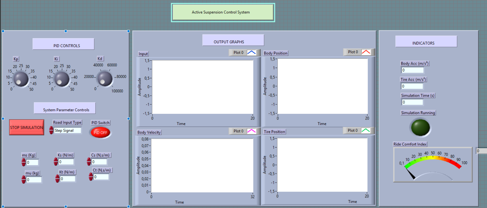
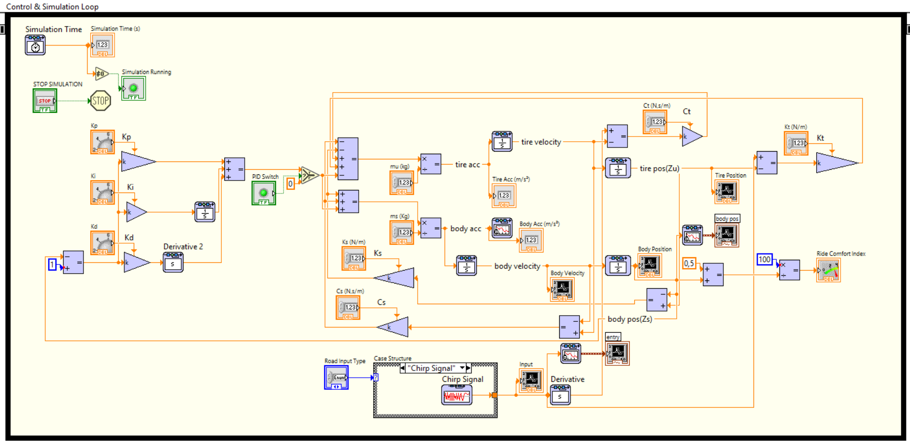
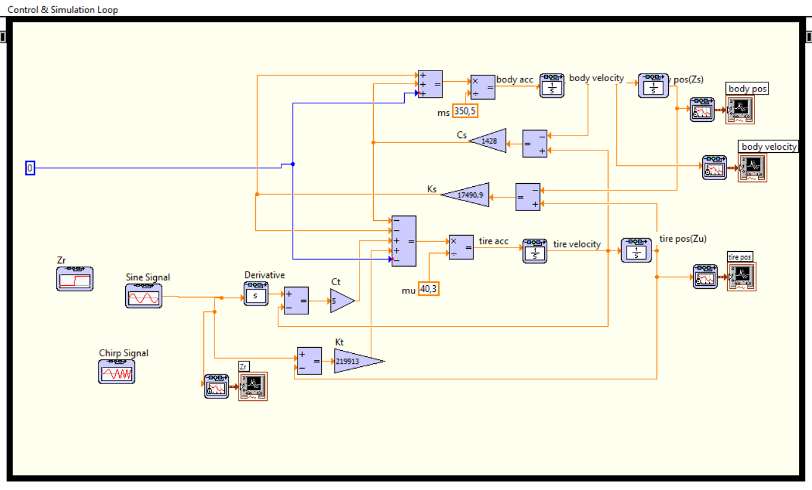

# 🚗 𝑺𝒊𝒎𝒖𝒍𝒂𝒕𝒊𝒏𝒈 𝒂𝒏𝒅 𝒄𝒐𝒏𝒕𝒓𝒐𝒍𝒍𝒊𝒏𝒈 𝒂𝒏 𝒂𝒄𝒕𝒊𝒗𝒆 𝒔𝒖𝒔𝒑𝒆𝒏𝒔𝒊𝒐𝒏 𝒔𝒚𝒔𝒕𝒆𝒎

A dynamic simulation and active control framework for a **Quarter-Car Suspension System** implemented in **NI LabVIEW** using the **Control & Simulation Loop**. This project provides an interactive interface to analyze, compare, and validate passive (open-loop) versus active PID-controlled (closed-loop) vehicle suspension architectures.

---

## 🎯 Engineering Benchmark & Significance

In automotive engineering, suspension design requires balancing two fundamentally conflicting requirements:
1. **Passenger Comfort:** Minimizing vertical acceleration and displacement of the vehicle body (Zs).
2. **Road Holding & Handling:** Maintaining optimal tire-to-road contact force (Zu) for steering and braking safety.

A passive suspension (spring + damper) is always a compromise. By introducing an **Active Suspension System with PID Feedback**, external force is applied dynamically in response to road irregularities. This benchmark demonstrates how mathematical modeling, physical parameter tuning, and classical control design integrate into a realistic mechatronic development workflow.

---

## ⚙️ Interactive Front Panel Features

The custom LabVIEW Front Panel UI provides full interactive control over system inputs, parameters, and live monitoring:

### 1. PID Tuning & Mode Switch
* **PID Switch:** Toggle dynamically between **Passive (PID OFF)** and **Active (PID ON)** control modes to benchmark performance in real time.
* **Interactive Knobs:** Live tuning of Proportional (Kp), Integral (Ki), and Derivative (Kd) gain parameters.

### 2. Road Disturbance Selection
Simulate realistic road profiles via an input selector:
* **Step Signal:** Evaluates transient response to sudden disturbances (e.g., speed bumps or potholes).
* **Sine Signal:** Analyzes steady-state harmonic excitation at specific frequencies.
* **Chirp Signal:** Sweeps across a continuous frequency spectrum to test system resonance and stability.

### 3. Configurable Quarter-Car Parameters
Full parameterization of vehicle mechanical dynamics:

| Parameter | Symbol | Units | Description |
|---|---|---|---|
| **Sprung Mass** | ms | kg | Vehicle body mass supported by the suspension |
| **Unsprung Mass** | mu | kg | Mass of wheel, tire, and axle assembly |
| **Suspension Stiffness** | Ks | N/m | Spring stiffness of the main suspension |
| **Tire Stiffness** | Kt | N/m | Equivalent stiffness of the tire |
| **Suspension Damping** | Cs | N.s/m | Damping coefficient of the shock absorber |
| **Tire Damping** | Ct | N.s/m | Internal damping coefficient of the tire |

---

## 📊 Live Monitoring & Instrumentation

* **Real-Time Output Graphs:**
  * `Input`: Disturbance signal trajectory.
  * `Body Position (Zs)`: Vertical displacement of the car chassis.
  * `Tire Position (Zu)`: Vertical displacement of the wheel assembly.
  * `Body Velocity`: Vertical speed of the chassis.
* **Digital Performance Indicators:**
  * `Body Acceleration (m/s²)`: Primary metric for passenger discomfort.
  * `Tire Acceleration (m/s²)`: Metric for road holding ability.
  * `Simulation Time (s)` and `Simulation Running` status LED.
* **Ride Comfort Index Gauge:** An integrated visual meter measuring overall ride quality in real time based on chassis motion.

---

## 📸 System Architecture & Visuals

### Interactive Front Panel UI

### Closed-Loop Active Control Diagram (`control_loop.vi`)

### Open-Loop Passive Simulation Diagram (`open_loop.vi`)

---

## 💡 Key Results & Insights

* **Oscillation Suppression:** Implementing the PID controller significantly reduces peak body displacement and settles oscillations faster compared to passive mode.
* **Comfort Optimization:** Real-time feedback dramatically lowers body acceleration, leading to measurable improvements on the **Ride Comfort Index**.
* **Model Validation:** The simulation successfully proves that active force generation compensates for diverse road profiles (Step, Sine, and Chirp), bridging theoretical control concepts with practical mechatronic design.

---
